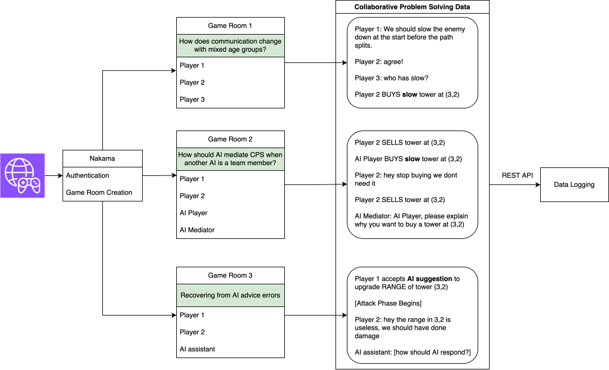

# CPS-TaskForge

Haduong, Nikita, Irene Wang, Bo-Ru Lu, Prithviraj Ammanabrolu, and Noah A. Smith. "CPS-TaskForge: Generating Collaborative Problem Solving Environments for Diverse Communication Tasks." arXiv preprint arXiv:2408.08853 (2024).
[Paper](https://arxiv.org/abs/2408.08853)

### Abstract

Teams can outperform individuals; could adding AI teammates further bolster performance of teams solving problems collaboratively? Collaborative problem solving (CPS) research commonly studies teams with two agents (human-human or human-AI), but team research literature finds that, for complex tasks, larger teams are more effective. Progress in studying collaboration with more than two agents, through textual records of team interactions, is hindered by a major data challenge: available CPS corpora are predominantly dyadic, and adapting pre-existing CPS tasks to more agents is non-trivial. We address this data challenge by developing a CPS task generator, CPS-TaskForge, that can produce environments for studying CPS under a wide array of conditions, and releasing a CPS task design checklist grounded in the theoretical PISA 2015 CPS framework to help facilitate the development of CPS corpora with more agents. CPS-TaskForge takes the form of a resource management (tower defense) game, and different CPS tasks can be studied by manipulating game design parameters. We conduct a case study with groups of 3-4 humans to validate production of diverse natural language CPS communication in a game instance produced by CPS-TaskForge. We discuss opportunities for advancing research in CPS (both with human-only and human-AI teams) using different task configurations. We will release data and code.

---

This repo contains code to create your own CPS Task Environment and the data collected in the pilot study of our work.

Running the study requires:

1. Starting a Nakama server, which handles authentication and game room creation
2. Starting a REST API data collection server. We used a Flask server, which we also provide.
3. Distributing and launching the binaries generated from CPS-TaskForge

Studies can be run in moderated or unmoderated modes.
The builds are shipped with an Admin panel, visible only to the person that creates the game room.

Only one player can hit `Play` to skip the rest of the `planning` phase and start spawning enemies. This player can change the game speed to 4x as well.

## Networking

Multiplayer syncing and logic is handled server-side, e.g., clients capture inputs and submit requests to the server. The server calculates an update to the game state and communicates to all clients the new game state.

We do not have a headless server set up, so the game host (person who creates a game room), acts as the server. In moderated games, the moderator is the server, and all players will have the same latency (e.g., when making an upgrade request, there is a slight delay between when the upgrade is requested and when it is delivered). If playing unmoderated and there are 4 players and 4 clients, then the hosting server (1 player) will have less latency. A workaround is to instruct one player to launch a second client to act as a "moderator" (==> 4 players and 5 clients are active). Instruct this player to only play the game in the non-host client.



# Dependencies

- Godot 4.3
- Nakama. Follow the [installation instructions](https://heroiclabs.com/docs/nakama/getting-started/install/docker/). We used the default settings alongside the Docker image with PostgresSQL on a private server.
- Python (for Flask data logging server. See requirements.txt in `server/`)

# Designing a study

We provide a [checklist](cps-checklist.png) that can assist with designing CPS tasks in general, and has sample answers that can help with using CPS-TaskForge specifically.

## Design Parameters

Most design parameters are found in the resource GameConfig. If you want to create a new custom config file, you'll create a new `.tres` file. If you want to add more parameters, then extend or edit the `GameConfig.gd` file.

### Game Parameters

- Unit Types:
  - Tower Types: The towers that are available in the game. We provide 12 types. [How to create new towers](#new-tower-type)
    - basic, poison
      (damage over time), piercing (damage multi-
      ple enemies in a straight line), splash (area
      damage), plant/obstacle (spawn an object on the
      track that does damage when enemies walk
      over it), slow (slows enemies), fear (enemies
      go backwards along the track), sniper (does
      more damage to faster enemies), discount
      (lowers upgrade costs of nearby towers), sup-
      port (buffs all stats for nearby towers), multi-
      shot (shoots in 4 directions)
    - Enemy Types: We provide 3 enemies with different attack/health/speed. We also include invisible enemy variants to act as spacers, so that an enemy wave can have spawn groupings instead of a constant stream of enemies.
- Username chat colors: We support up to 4 players at the moment. Each player is assigned a color from this list using their `element_idx`, which is randomly assigned at the start of the game. To support an arbitrary number of players, this system needs to be redone.

### Experiment Parameters

- Level Progression: An array of LevelData.tres resources that detail how much gold players start with, their HP, which towers are given to which player (through a lookup using `element_idx`), the Map, the duration of `planning phase` before enemies begin spawning, and which tiles are valid for placing towers. By default, you can only place towers on green tiles.
- Num rounds per level: How many times a level should be played before moving to the next Level in the LevelProgression sequence.
- Text Chat Enabled: Can people communicate using text?
- (TODO) Voice Chat Enabled: Can people communicate using their microphone?
- (TODO) Push To Talk: Voice chat is only captured when a hotkey is pressed
- Can Modify Other Players Towers: By default, players can only buy/sell/upgrade their own towers (assigned in the Level's AvailableUnits). If True, then players can sell/upgrade other players' towers.
- Show Enemey Preview Panel: Do players get to preview the sequence of enemies coming from each spawn point?
- Shared Player Resources: By default, there is one set of HP/Gold/Score for the team of players. A potential future feature is to also have individual scores, which would enable studying how teams behave when individuals have competing incentives
- AutoBattler mode: By default, we use autobattler (no dynamic `attack` phase). If `false`, the game will have the dynamic `attack` phase where players can continue building towers while enemies are spawning. Otherwise known as RTS (real-time strategy) mode.
- Show Tower Name: Do we name our towers and give the players a name to refer to?
- Show Tower Description: Do we tell the players what each tower does, or do they need to figure it out?
- Continue to next level automatically: If false, the moderator or game room host (in unmoderated sessions) needs to click `Continue to next round` at the end of a game. If true, a 15 second countdown will appear to indicate when the next round will start.

### Nakama

Set your Nakama server parameters here. This is necessary for handling user authentication and creating game rooms.
See the [official documentation](https://heroiclabs.com/docs/nakama/getting-started/configuration/) for an explanation of the values. In our study, we used default values and only changed the `nakama_host` to our server IP.

### Data Logging

- Log Data: If true, log data to your server using REST API.
- Data logging server url: Set this to your Data logging server endpoint, e.g., an IP:Port for Flask server

Methods are defined in `HTTP.gd`, which is autoloaded at game launch. You can adjust this file to add new methods for your custom data logging.

By default, we include some metadata with every REST request:

- All experiment parameters located in the GameConfig
- Timestamp
- Current Level/Round
- Client Player Map: mapping of players (username) to element_idx, so that later on you can look up which player had access to which towers and other values that were assigned based on element_idx
- Room ID: The game room ID that players used to join a room
- Game ID: The team name of the game room

# Creating an Environment

If you want to keep the same settings that we used, then you only need to build the binaries, or make some [Levels](#new-level) for your participants to play.

## [New Tower Type]

1. Duplicate the BaseTower.tscn scene, e.g. NewTower.tscn
2. In the parent node (BaseTower), create a new script that extends BaseTower.gd, e.g., NewTower.gd. Make sure this script is attached to BaseTower (parent node), otherwise it won't run.
3. Implement any override methods needed, such as `Shoot()`, and `_look_at_enemy()`.
4. Create a new TowerData.tres file (see TowerTypes for examples). Set all the fields as needed. The most important field to set is `tower_to_instantiate`, which is a string key.
5. In your GameConfig file, add a new key/value pair to `tower_types_objects` using `key=tower_to_instantiate` and `value=NewEnemy.tscn`.
6. (Optional) If your tower has a special bullet effect (see Plant or Splash for examples), then you'll also need to create a new bullet.
   6a. Duplicate base_bullet.tscn scene, e.g., new_bullet.tscn
   6b. In the parent node (base_bullet), create a new script that extends base_bullet.gd, e.g., new_bullet.gd. Make sure this script is attached to the parent node.
   6c. Implement any overrides
   6d. In NewTower.tscn, change the Bullet variable to reference new_bullet.tscn. Your tower will now start shooting new_bullet.tscn bullets.

## [New Enemy Type]

## [New Level]

Creating a new level requires a few designs:

1. The Map
2. Enemy spawn behavior (see EnemyWaves description)
3. LevelData

After creating the LevelData, make sure to add it to the GameConfig.LevelProgressions list, otherwise the experiment won't contain the level you just designed!

The easiest way to create a new Map is to duplicate one from FinalLevels and modify it.

### Map

Components of a Map

- Paths (Node): Container that will hold Path2Ds for enemy paths.
- Paths2Ds: the paths that enemies will follow. Enemies spawn at the first node in the path. All of these should be children of the Paths node.
- DamagePlayer (Area2D): When an enemy enters this area, they will damage the player. We only support one damage box for now.
- Spawner Labels: You can add spawnpoint labels, for reference in the enemy preview so that players know which spawnpoint enemies will spawn from. This is optional.
- Map (TileMap): This is the visual map of the level, and is the root of a Map scene. You can tile and design your visual map as desired--it functions as a background. Keep in mind which tiles you want to let players build towers on. By default, we only let players build on the grassy/green tiles, which have coordinate 1,1 in the tilesheet. This coordinate will be used in LevelData
- EnemyWaves: Array of EnemyWave that describes enemy spawn behavior. You need to populate the Enemy Wave Data field in Map.gd.
  - EnemyWave fields
    - Wave: the sequences of enemies to spawn.
    - WaveCount: how many of each enemy to spawn. The indices are paired. (The reason for using two separate data structures is because other implementations take longer to edit in the Godot editor.)
    - SpawnerID: Which path the enemy wave will spawn and follow

### LevelData

- Gold_autobattler: how much gold the team starts with when playing in autobattler mode (no dynamic attack phase)
- Gold: how much gold the team starts with in RTS mode (planning and attack phase)
- Health: Amount of damage players can take before they lose the game
- AvailableUnits {element_idx:List[int]}: The mapping of player's element_idx to the towers they can play. The towers are referenced by their `tower_type` field; e.g., basic_tower has tower_type == 0, so we can make the player with element_idx==1 have access to basic_tower: {1:[0]}
- Map: The map.tscn that you just created
- Grid: Information for cell size and tile size. If you use the provided tileset, then you don't need to adjust this
- Valid Buy Tiles: the coordinates of tiles that you allow players to build towers on. We only allowed them to build on the green/grassy tiles, which have coordinates (1,1)
- Wave timer (minutes, seconds, autobattler): The duration of the planning phase before the attack phase automatically begins.

# Exporting Binaries

Only Windows and Mac builds were tested in our pilot study. Web builds might have support, depending if you can set up the appropriate SSL/HTTPS/CORS environments for your Nakama and Data logging server. However, Godot web builds have a long load time, so the user experience is suboptimal, with blank webpages making the site appear broken. Voice is not supported over Web.

# Pilot study process

Our pilot studies were all moderated and run with a mixture of local and remote play. The moderator was needed to set up the game room, otherwise the experiment could run on its own.
We used Slottr to organize team signups. After experiment slots filled with enough people, the experiment was scheduled. Participants were requested to verify the game ran before the experiment time.
When the experiment began, an instruction document was distributed to players.

** On a remote server **

1. Start the Nakama server

```
cd nakama
docker-compose up
```

2. Start the data logging server

```
cd server/app
conda activate godot
flask run --host=0.0.0.0 -p 5000
```

3. Run moderated study. Have all participants launch the game. As moderator, log in and create a game room. Paste the key to a google doc that all players have access to. Wait for everyone to join the room, then enable the `I'm Ready` button. Set any parameters (RTS/Autobattler mode, which level to start on if the study was interrupted, etc.). Then begin the game. After every round is completed, manually begin the next round.

# Stress test data logging

We stress tested our data logging server using locust
`locust -f locustfile.py` to ensure all data is logged in the event we run multiple studies simultaneously.

# TODO

[ ] Guest play (anonymous login, instead of making accounts)
[ ] Voice chat, and push to talk, with data logging.
[ ] Multiple experiments within one client session
[ ] Pause/reconnect to current running experiment
